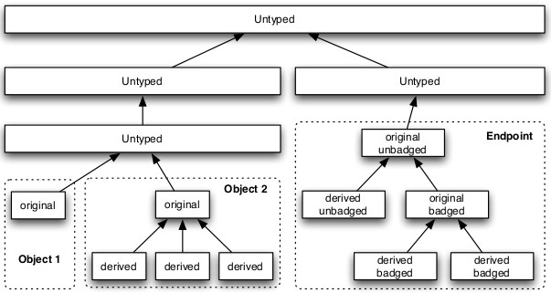

### 3.1.5  能力派生树[^1]

As mentioned in Section 2.4.1, seL4 keeps track of capability derivations in a capability derivation tree.

如2.4.1节所述，seL4通过能力派生树跟踪能力派生。

Various methods, such as seL4_CNode_Copy() or seL4_CNode_Mint(), may be used to create derived capabilities. Not all capabilities support derivation. In general, only original capabilities support derivation invocations, but there are exceptions. Table 3.2 summarises the conditions that must be met for capability derivation to succeed for the various capability types, and how capability-derivation failures are reported in each case. The capability types not listed can be derived once.

不同的方法，如seL4_CNode_Copy()或seL4_CNode_Mint()，可以用于创建派生能力。并不是所有的能力都支持派生。一般来说，只有*原始*能力支持派生调用，但也有例外。表3.2总结了不同类型能力派生成功所必须满足的条件，以及失败情况下如何报告错误，未列出的能力类型只允许派生一次。

| 能力类型 | 派生条件 | 派生失败错误码 |
| -------- | -------- | -------------- |
| ReplyCap | 不能派生 | 依赖系统调用 |
| IRQControl | 不能派生 | 依赖系统调用 |
| Untyped  | 不能有子对象(见3.2节) | seL4_RevokeFirst |
| 页表     | 必须已映射 | seL4_IllegalOperation |
| 页目录   | 必须已映射 | seL4_IllegalOperation |
| IO页表(仅IA-32架构) | 必须已映射 | seL4_IllegalOperation |

表3.2：能力派生

图3.1：能力派生树示例

Figure 3.1 shows an example capability derivation tree that illustrates a standard scenario: the top level is a large untyped capability, the second level splits this capability into two regions covered by their own untyped caps, both are children of the first level. The third level on the left is a copy of the level 2 untyped capability. Untyped capabilities when copied always create children, never siblings. In this scenario, the untyped capability was typed into two separate objects, creating two capabilities on level 4, both are the original capability to the respective object, both are children of the untyped capability they were created from.

图3.1显示了一个示例能力派生树，它演示了一个标准的应用场景：顶层是一个大的未分配内存能力。第二层将其分解为两个小的未分配内存能力，它们都是顶层的子级。第三层左边，是第二层能力的副本；拷贝未分配内存能力总是创建子能力，而不是同级能力。在这个场景中，未分配内存能力被分配为两个单独的对象，在第四级创建了两个能力，它们既是各自对象的原始能力，也是创建它们的未分配内存能力的子能力。

Ordinary original capabilities can have one level of derived capabilities. Further copies of these derived capabilities will create siblings, in this case remaining on level 5. There is an exception to this scheme for Endpoint and Notification capabilities — they support an additional layer of depth though badging. The original Endpoint or Notification capability will be unbadged. Using the mint method, a copy of the capability with a specific badge can be created (see Section 4.2.1, Section 5.1). This new, badged capability to the same object is treated as an original capability (the “original badged endpoint capability”) and supports one level of derived children like other capabilities.

普通的原始能力可以有一个级别的派生能力，这些派生能力的进一步拷贝将创建同级能力，在本例中都位于第五级。对于端点和通知能力，这个模式有一个例外(见右侧图)-它们支持通过*标记*增加一层深度。原始的端点或通知能力将被取消标记，使用mint方法可以创建具有特定*标记*的能力副本(参见4.2.1节，5.1节)，这个新的、有标记的能力被视为原始能力(“原始标记端点能力”)，可以像其他能力一样支持派生一级子能力。

[^1]: 本节所述与源码差距很大，请读者谨慎判断。
