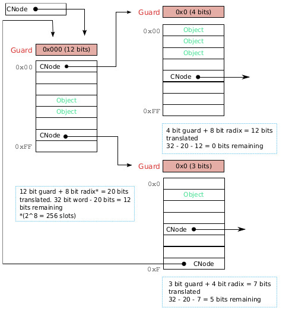

### 3.3.1  能力地址查找

与虚拟内存地址一样，能力地址也是一个简单的整数。与指向物理内存位置不同(像虚拟内存地址)，能力地址指向能力slot。在查找由用户空间线程提供的能力地址时，内核首先查看线程TCB中存储的定义了线程CSpace根的CNode能力。它将根CNode能力的保护位与能力地址的最高有效位(guard部分)进行比较，如果两个值不同，则查找失败；否则，内核将用能力地址中下一个最高有效*基数*位(radix部分)来索引CNode中的slot，查找到的槽`s`可能包含另一个CNode能力，或者其他能力(包括空)。如果`s`包含的是一个CNode能力`c`，并且原能力地址中还有剩余要解析的位(radix部分之后)，查找过程将重复进行：从CNode能力`c`开始，解析原能力地址的这些剩余位；否则，查找过程将成功终止，要查找的能力地址指向的就是槽`s`。

图3.2演示了一个有以下特性的有效CSpace：

- 顶层CNode对象有12位保护值0x000和256个slots

- 顶层CNode有直接的对象指引

- 顶层CNode有两个二级CNode指引

- 二级CNode有不同的保护位和slot数量

- 一个二级CNode包含有对顶级CNode的指引

- 一个二级CNode包含对另一个CNode的指引，其中还有一些位需要解析

- 一个二级CNode包含对另一个CNode的引用，其中没有剩余的位需要解析

图3.2：一个多级、有不同保护位、基数大小和内部CNode指引的CSpace示例

应该注意的是，图3.2只是演示了可能的情况，而不是通常实际的情况。尽管CSpace是合法的，但是由于slot的数量很少，而且其中有循环指引，所以使用它会相当困难。
