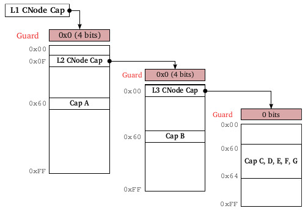

### 3.3.2 能力寻址

A capability address is stored in a CPointer (abbreviated CPTR), which is an unsigned integer variable. Capabilities are addressed in accordance with the translation algorithm described above. Two special cases involve addressing CNode capabilities themselves and addressing a range of capability slots.

能力地址存储在一个CPointer(缩写为CPTR)[^1]中，它是一个无符号整数变量。能力根据上面描述的转换算法进行寻址。有两种特殊情况，涉及到对CNode能力的寻址和对能力slots范围的寻址。

Recall that the translation algorithm described above will traverse CNode capabilities while there are address bits remaining to be translated. Therefore, in order to address a CNode capability, the user must supply not only a capability address but also specify the maximum number of bits of the capability address that are to be translated, called the depth limit.

回想一下上面的寻址CNode能力的转换算法，只要还有地址位需要转译，就会继续遍历CNode能力。因此，为了寻找一个CNode能力，用户不仅必须提供能力地址，还必须指定能力地址中要解析的最大位数，这称为*`深度限制`*。

Certain methods, such as seL4_Untyped_Retype(), require the user to provide a range of capability slots. This is done by providing a base capability address, which refers to the first slot in the range, together with a window size parameter, specifying the number of slots (with consecutive addresses, following the base slot) in the range.

某些调用，如seL4_Untyped_Retype()，要求用户提供需要寻址的能力槽的范围。这是通过提供一个能力基地址（指向范围内第一个槽）和一个指明槽数量的窗口参数（位于第一个槽之后的连续多少个槽）来实现的。

Figure 3.3 depicts an example CSpace. In order to illustrate these ideas, we determine the address of each of the 10 capabilities in this CSpace.

图3.3描述了一个CSpace示例。为了说明这些思想，我们设定了CSpace中10个能力的地址。

图3.3：一个任意CSpace布局

* **能力A**

    The first CNode has a 4-bit guard set to 0x0, and an 8-bit radix. Cap A resides in slot 0x60 so it may be referred to by any address of the form 0x060xxxxx (where xxxxx is any number, because the translation process terminates after translating the first 12 bits of the address). For simplicity, we usually adopt the address 0x06000000.

    第一个CNode有4位的保护位（0x0），基数为8位。能力A驻留在槽0x60位置处，因此它可以由任何具有0x060xxxxx形式的地址进行引用(其中xxxxx是任意数字，因为解析过程在前12位之后终止)。为简单起见，我们通常采用地址0x06000000。

* **能力B**

    Again, the first CNode has a 4-bit guard set to 0x0, and an 8-bit radix. The second CNode is reached via the L2 CNode Cap. It also has a 4-bit guard of 0x0 and Cap B resides at index 0x60. Hence, Cap B’s address is 0x00F06000. Translation of this address terminates after the first 24 bits.

    同样，L1级能力节点的第一个CNode有4位的保护值0x0，基数为8位。第二个CNode也有一个4位保护值0x0，它是通过L2级CNode能力进行引用的，能力B驻留在索引0x60处。因此，能力B的地址是0x00F06000。此地址的解析在前24位之后终止。

* **能力C**

    This capability is addressed via both CNodes. The third CNode is reached via the L3 CNode Cap, which resides at index 0x00 of the second CNode. The third CNode has no guard and Cap C is at index 0x60. Hence, its address is 0x00F00060. Translation of this address leaves 0 bits untranslated.

    这个能力是通过两个CNode来寻址的。第三个CNode通过L3级CNode能力引用，该能力驻留在第二个CNode的索引0x00处。第三个CNode没有保护位，能力C在索引0x60处，因此它的地址是0x00F00060。这个地址的解析用完了所有的地址位。

* **能力C~G**

    This range of capability slots is addressed by providing a base address (which refers to the slot containing Cap C) of 0x00F00060 and a window size of 5.

    这个范围内的能力槽通过提供一个0x00F00060基地址(包含能力C的槽)和一个大小为5的窗口来寻址。

- **L2 CNode Cap**

    Recall that to address a CNode capability, the user must supply not only a capability address but also specify the depth limit, which is the maximum number of bits to be translated. L2 CNode Cap resides at offset 0x0F of the first CNode, which has a 4-bit guard of 0x0. Hence, its address is 0x00F00000, with a depth limit of 12 bits.

    前面提到过，要寻址一个CNode能力，用户不仅要提供一个能力地址，还要指定深度限制，也即要解析的最大位数。L2级CNode能力位于第一个CNode的偏移0x0F处，CNode有4位保护值为0x0，因此它的地址是0x00F00000，深度限制为12位。

- **L3 CNode Cap**

    This capability resides at index 0x00 of the second CNode, which is reached by the L2 CNode Cap. The second CNode has a 4-bit guard of 0x0. Hence, the capability’s address is 0x00F00000 with a depth limit of 24 bits. Note that the addresses of the L2 and L3 CNode Caps are the same, but that their depth limits are different.

    这个能力位于第二个CNode的索引0x00处，它由L2级CNode能力进行引用。第二个CNode有一个4位的保护值0x0。因此，该能力的地址是0x00F00000，深度限制为24位。注意，L2和L3级CNode能力的地址是相同的，但它们的深度限制不同[^2]。

In summary, to refer to any capability (or slot) in a CSpace, the user must supply its address. When the capability might be a CNode, the user must also supply a depth limit. To specify a range of capability slots, the user supplies a starting address and a window size.

总之，要引用CSpace中的任何能力（或槽），用户必须提供其地址。如果该能力还是一个CNode能力时，还需提供深度限制。要寻址某个范围的能力槽，用户要提供一个起始地址和窗口大小。

[^1]: 后文尤其是在API参考部分，将用*能力句柄*称谓能力地址，因为这个地址既不是通常意义上的地址或指针值，也不是简单的slots数组索引，而是需要参数约束的解析指示，很像我们熟知的*句柄*含义。CPTR有时独立使用，并用默认的机器字位数作深度限制；有时用index、depth两个参数来表示，其中index就是CPTR。

[^2]: 在API调用时，这个地址还需要按照深度进行右对齐，即，L3级CNode能力的地址为0x00F000，共24个有效位，恰好是深度。同理，L2级CNode能力的地址为0x00F，共12个有效位，与深度相同。
