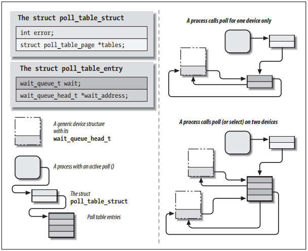

* [6.3 poll和select](#6.3)
    * [6.3.1 与read和write的交互](#6.3.1)
    * [6.3.2 底层数据结构](#6.3.2)

***

<h2 id="6.3">poll和select</h2>

使用非阻塞IO的应用程序可以调用 *`poll`*, *`select`*, 和 *`epoll`*系统函数。  *`poll`*, *`select`*, 和 *`epoll`*本质上具有相同的功能：都是允许一个进程是否能通过非阻塞的方式读写一个或者多个文件。当给定的文件描述符集中没有文件可以读取，就会阻塞进程。因此，往往用于具有多个输入输出流的应用程序中，避免程序被某个输入输出流阻塞住。为什么相同的功能要实现多个函数呢？因为它们分别由不同的组实现，*`select`*是`BSD Unix`引入的概念，而 *`poll`*是由`System V`引入的。为了增加文件描述符的个数，从Linux内核2.5.45开始，又引入了 *`epoll`*。

当然了，这肯定需要驱动程序的支持。这三种调用都是通过驱动程序的 *`poll`* 方法提供的，原型如下：

    unsigned int (*poll) (struct file *filp, poll_table *wait);

当用户空间程序调用 *`poll`*, *`select`*, 或 *`epoll`*时，它们处理的文件描述符与驱动程序相关联，然后，驱动程序的 *`poll`* 方法就会执行。

1. 对于一个或多个 *`wait`* 队列调用 *`poll_wait`*,就能指示出轮询的状态。如果没有可用于I/O的文件描述符，内核就会让进程继续等待传递给系统调用的所有文件描述符
2. 返回一个能够立即非阻塞执行的文件描述符掩码

这些操作简单明了，各个驱动程序的这类操作看起来很相似。然而，它们非常依赖驱动程序提供的信息，因此每个驱动程序必须单独实现。

结构体 *`poll_table`* 是 *`poll`* 方法的第`2`个参数，用来在内核中实现*`poll`*, *`select`*, 和 *`epoll`*系统调用，其声明在 *`<linux/poll.h>`*文件中。 所以，在驱动程序的源代码中一定要包含这个文件。 驱动程序的作者不需要关心其内部细节， 把其当做一个 **黑盒子**使用即可。 它被传递给驱动程序的方法， 以至于驱动可以把等待队列载入，然后唤醒进程并改变 *`poll`* 的状态。  驱动程序通过调用函数 *`poll_wait`*添加一个等待队列到结构体 *`poll_table`*中。

    void poll_wait (struct file *, wait_queue_head_t *, poll_table *);

*`poll`*执行的第2个任务就是返回描述那些操作可以立即完成的位掩码，这也很简单。 例如， 如果设备有数据可用， *`read`*就会立即无阻塞的执行； *`poll`*就应该指出这种情况。 下面的标志用来指明这些可能的操作，其定义位于文件 *`<linux/poll.h>`*中。

>**POLLIN**
>
>       要想设备能够非阻塞的可读，必须设置。
>
>**POLLRDNORM**
>
>       “正常”数据可读取，必须设置。 可读设备应该返回 (POLLIN | POLLRDNORM)。
>
>**POLLRDBAND**
>
>       通常只用于linux内核某一处(DECnet码)且通常不会用于设备驱动程序。
>
>**POLLPRI**
>
>       无阻塞读取高优先级的数据（out-of-band）。select方法会报异常（带外数据）。
>
>**POLLHUP**
>
>       看到文件结束时，必须设置此位。
>
>**POLLERR**
>
>       设备发生错误，设置此位。调用 `poll`，会返回设备可读写，因为read和write都会返回错误代码而不会阻塞。
>
>**POLLOUT**
>
>       设备可以非阻塞地写入时，设置此位。
>
>**POLLWRNORM**
>
>        与POLLOUT相同，甚至有时候都是相同的数字。可写设备应该返回(POLLOUT | POLLWRNORM)。
>
>**POLLWRBAND**
>
>       像POLLRDBAND，表示可以将非0优先级的数据写入设备。只有poll数据报实现中使用。

值得注意的是 **POLLRDBAND** 和 **POLLWRBAND**只对套接字文件描述符有意义， 正常情况下，设备驱动程序不使用这些标志。

*`poll`*描述了这么多， 但是使用很简单。 下面是 *`scullpipe`* 的 *`poll`*方法实现：

    static unsigned int scull_p_poll(struct file *filp, poll_table *wait)
    {
        struct scull_pipe *dev = filp->private_data;
        unsigned int mask = 0;

        /*
         * scull_pipe中的buffer是循环的； 如果 "wp" 紧跟在 "rp" 后边， 认为满； 如果两者相等， 则认为空
         */
        down(&dev->sem);
        poll_wait(filp, &dev->inq, wait);
        poll_wait(filp, &dev->outq, wait);
        if (dev->rp != dev->wp)
            mask |= POLLIN | POLLRDNORM;            /* 可读 */
        if (space_free(dev))
            mask |= POLLOUT | POLLWRNORM;           /* 可写 */
        up(&dev->sem);
        return mask;
    }

该段代码完成`2`部分工作， 添加 *`scullpipe`* 的两个等待队列到 *`poll_table`* 中， 然后设置数据是否可读写的掩码并返回。

如上所示的代码中， 缺少文件结束符的支持。 因为 *`scullpipe`* 设备不支持文件结束。 对于许多真实的设备， 如果没有数据可用 *`poll`* 应该返回 *`POLLHUP`* 。  如果调用者使用 *`select`* 系统调用， 则该文件被报告为可读。 无论使用 *`poll`* 还是 *`select`* ， *`read`* 方法都会返回 `0`， 表明文件结束， 应用程序从而知道可以非阻塞的读取文件。

例如， 对于真正的FIFO， 当所有写入关闭文件时， 读取调用就会看到文件结尾， 而在 *`scullpipe`*中， 读取调用永远不会看到文件结束。 它们行为是不同的， FIFO旨在成为两个进程之间的通信通道， 而 *`scullpipe`*是一个`垃圾桶`， 每个人都可以放置数据。 而且， 重新实现内核中已有的内容是没有意义的。 所以， 在示例中， 实现不同的行为。

在 *`read`* 和 *`poll`* 中， 以与FIFO相同的方式， 实现对文件结束的支持， 就意味着检查 *`dev-> nwriters`*。 不幸的是， 通过这种实现， 如果读取在写入者之前打开了 *`scullpipe`*设备， 它将看到文件结束而没有机会等待数据。 解决这个问题的最好方法是在开放时实现阻塞， 就像真正的FIFO一样;  这个任务留给读者练习。

***

<h3 id="6.3.1">6.3.1 与read和write的交互</h3>

调用 *`poll`* 和 *`select`* 的目的是提前确定I/O操作是否会阻塞。 在这方面， 它们是 *`read`* 和 *`write`* 的补充。  *`poll`* 和 *`select`* 更重要的作用是， 让应用程序同时等待几个数据流， 尽管在 *`scull`* 示例中没有利用这个特点。

正确实现这3个调用对于应用程序正常工作至关重要： 尽管以下规则已经或多或少地陈述过， 但在这儿， 我们还是要总结一下。

####从设备中读取数据

* 如果输入缓冲区中有数据， 即使就绪的数据比应用程序请求的少， 且驱动程序保证剩余的数据很快到达， *`read`* 调用还是能以难以察觉的延迟返回。 如果这样做很方便 （ 就像 *`scull`* 中实现的那样）， 返回至少一个字节， 那么， 总是可以返回比请求少的数据。 在这种情况下， *`poll`* 应该返回 **POLLIN** | **POLLRDNORM**。
* 如果输入缓冲区中没有数据， 默认情况下， *`read`* 必须阻塞， 直到至少有一个字节。 另一方面， 如果设置了 **O_NONBLOCK**， *`read`*会立即返回 **-EAGAIN** （尽管某些旧版本的System V在这种情况下返回0）。 在这些情况下， *`poll`*必须报告设备不可读， 直到至少一个字节到达。 一旦缓冲区中有一些数据，我们就会回到前一种情况。
* 如果我们处于文件结尾， 则应立即返回0， 与 **O_NONBLOCK** 无关。 在这种情况下 *`poll`* 应该报告 **POLLHUP**。

####向设备中写入数据

* 如果输出缓冲区有空间， *`write`*应立即返回。 可以接受比请求少的数据， 但至少有一个字节。 在这种情况下， *`poll`*应通过返回 **POLLOUT|POLLWRNORM** 报告设备可写。
* 如果输入缓冲区满， 默认情况下 *`write`*立即阻塞， 直到有空间可写。 如果设置了 **O_NONBLOCK**， *`write`*立即返回**-EAGAIN** （旧System V Unices返回0）。 在这种情况下， *`poll`*报告文件不可写。 另一方面， 如果设备不能接受更多数据， *`write`*返回 **-ENOSPC**（“No space left on device”）， 无论是否设置 **O_NONBLOCK**。
* 即使 **O_NONBLOCK**被清除， 在 *`write`*调用返回前， 绝不可让其等待数据传输完成。 这是因为会有许多应用使用 *`select`*去查看是否有 *`write`*被阻塞。 如果设备报告可写， 调用就不会阻塞。 如果使用该设备的程序要保证数据缓冲区的数据被传输， 驱动程序就必须提供 *`fsync`*方法。 例如可移除设备就必须有 *`fsync`*入口点。

虽然这是一组很好的规则， 但是必须认识到， 每个设备都是独一无二的， 有时候， 就需要变通一下执行。 例如， 面向记录的设备 （ 例如磁带机）就必须按记录写入，而不能部分写数据。

####刷新挂起的输出

我们已经看到 *`write`* 不能满足所有的数据输出要求。 这时候就需要 *`fsync`* 函数， 其原型是：

    int (*fsync) (struct file *file, struct dentry *dentry, int datasync);

如果要确保应用程序的数据被发送到设备上， 无论是否设置 **O_NONBLOCK**， 都必须实现 *`fsync`*方法。 只有当设备完全被刷新后， *`fsync`*方法才能够返回。 参数 `datasync` 只是用来区分 *`fsync`* 和 *`fdatasync`*系统调用； 这个参数只对文件系统有用， 设备驱动不需要关心。

*`fsync`* 方法没有特殊的功能。 该调用对时间也不敏感， 因此每个设备驱动程序都可以根据作者的喜好来实现。 大多数时候， 字符驱动程序的 `fops` 中设置为 `NULL`指针。 而块设备总是使用通用的 *`block_fsync`*来实现该方法， 刷新设备的所有块， 等待I/O操作完成。

***

<h3 id="6.3.2">6.3.2 底层数据结构</h3>

对于熟悉工作原理的人来说，*`poll`* 和 *`select`*系统调用的实现相当简单; *`epoll`* 稍微有点复杂， 但都建立在相同的原理上。 每当用户应用程序调用 *`poll`*， *`select`* 或 *`epoll_ctl`* 时， 内核会调用该系统调用引用的所有文件的 *`poll`*方法， 并向它们传递给相同的 *`poll_table`*。 *`poll_table`*结构是构成实际数据结构的简单封装。 对于 *`poll`* 和 *`select`*，该结构是包含 *`poll_table_entry`*结构的内存页的链接列表。 每个 *`poll_table_entry`*都拥有 *`struct file`* 和 *`wait_queue_head_t`*指针， 这些指针以及相关的等待队列项， 传递给 *`poll_wait`*方法 。 对 *`poll_wait`* 的调用， 有时也会将进程添加到给定的等待队列中。 整个结构必须由内核维护， 以便在 *`poll`*或 *`select`*返回之前可以从所有队列中删除进程。

结构体*`poll_table`*， 其定义如下所示：

    typedef struct poll_table_struct
    {
        poll_queue_proc qproc;
        unsigned long key;
    } poll_table;

如果被轮询的驱动程序都没有指示I/O可以在没有阻塞的情况下发生， 除非等待队列中的一个能够唤醒它， 否则 *`poll`* 将一直休眠。

在 *`poll`* 的实现中有趣的是，可以把 *`poll_table`*参数赋值为 `NULL`。 出现这种情况有几个原因。 如果调用 *`poll`*的应用程序提供了超时值0（表示不应该等待）， 则没有理由累积等待队列， 系统也不允许这样做。 轮询的任何驱动程序， 如果指示I/O可用后， *`poll_table`* 指针也立即设置为 `NULL`。 因为， 内核在那时知道不会发生等待， 因此它不会构建等待队列列表。

当 *`poll`*调用完成， *`poll_table`*结构体就会被释放， 先前添加到轮询表中的所有等待队列项都会从表和它们的等待队列中移除。

图6-1中显示`poll`中涉及的数据结构; 该图是实际数据结构的简化表示， 因为它忽略了`poll`表的多页性质， 并忽略了作为每个 *`poll_table_entry`*一部分的文件指针。 如果对细节感兴趣， 请看 *`<linux/poll.h>`*和 *`fs/select.c`*。

此时此刻， 就能够理解增加 *`epoll`* 系统调用的目的了。 通常情况下， *`poll`* 和 *`select`* 只会涉及几个文件描述符， 所以建立该数据结构的开销相对比较小。 但是， 有的应用程序需要处理成千上万的文件描述符。 那么， 再以此方式， 建立、 销毁数据结构就会带来很大的开销。 而 *`epoll`* 允许应用程序在内核中只建立一次数据结构， 多次使用。